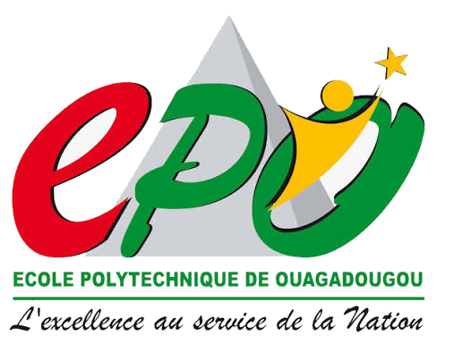

{ .hero-logo }

# Dr. Zakaria Sawadogo

**École Polytechnique de Ouagadougou**

Enseignant-chercheur en sécurité informatique, intervenant dans plusieurs cycles ingénieur de l'École Polytechnique de Ouagadougou.

[:material-school-outline: Voir les cours](cours/index.md){ .md-button .md-button--primary }

## Présentation

Dr. Zakaria Sawadogo enseigne la sécurité informatique à l'École Polytechnique de Ouagadougou, dans plusieurs cycles ingénieur. L'ensemble du support de cours — chapitres, présentations et travaux pratiques — des matières publiées en ligne est disponible depuis l'onglet **Cours**.

## Organisation de mes enseignements

-   :material-access-point-network:{ .lg .middle } **Cycle ingénieur Télécommunications**

    ---

    - [Gouvernance et gestion des risques de la sécurité de l'information](04-gouvernance-gestion-risques-si/index.md)
    - [Ingénierie de la cryptographie](06-cryptographie/index.md) tronc commun
    - [Sécurité des applications](09-securite-des-applications/index.md) tronc commun
    - [Service web](10-service-web/index.md) tronc commun

-   :material-shield-lock-outline:{ .lg .middle } **Cycle ingénieur Cybersécurité**

    ---

    - [Audit organisation et technique](02-audit-organisation-technique/index.md)
    - [Cryptanalyse](03-cryptanalyse/index.md)
    - [IA appliquée à la sécurité informatique](05-ia-appliquee-securite-informatique/index.md)
    - [Technologie Blockchain](07-technologie-blockchain/index.md)
    - [Analyse de malwares et sécurisation des données](11-analyse-malwares-securisation-donnees/index.md)
    - [Sécurité des applications](09-securite-des-applications/index.md) tronc commun
    - [Service web](10-service-web/index.md) tronc commun

-   :material-code-tags:{ .lg .middle } **Cycle ingénieur Logiciel**

    ---

    - [Ingénierie de la cryptographie](06-cryptographie/index.md) tronc commun
    - [Sécurité des applications](09-securite-des-applications/index.md) tronc commun
    - [Security by design](08-security-by-design/index.md)
    - [Service web](10-service-web/index.md) tronc commun

-   :material-chart-bar:{ .lg .middle } **Cycle ingénieur Data science**

    ---

    - [Ingénierie de la cryptographie](06-cryptographie/index.md) tronc commun
    - [Sécurité des applications](09-securite-des-applications/index.md) tronc commun
    - [Service web](10-service-web/index.md) tronc commun

-   :material-tshirt-crew-outline:{ .lg .middle } **Cycle ingénieur Textiles**

    ---

    - [Algorithmique et Programmation en C](01-algorithmique-programmation-c/index.md)

Toutes les matières listées ci-dessus ont leur support de cours complet (chapitres, présentations, travaux pratiques) publié sur ce site.

---

*Dr. Zakaria Sawadogo — École Polytechnique de Ouagadougou*
